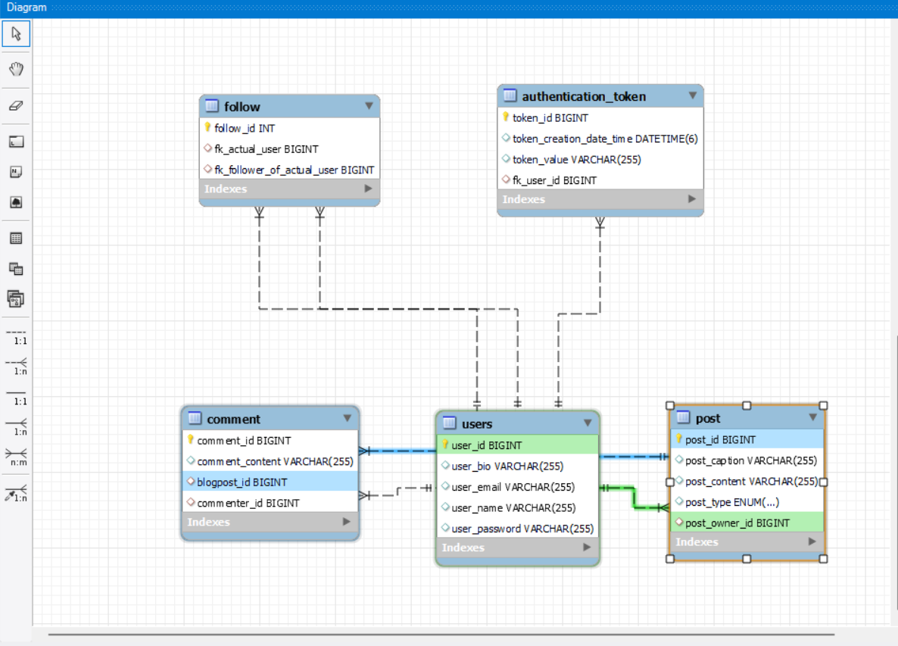
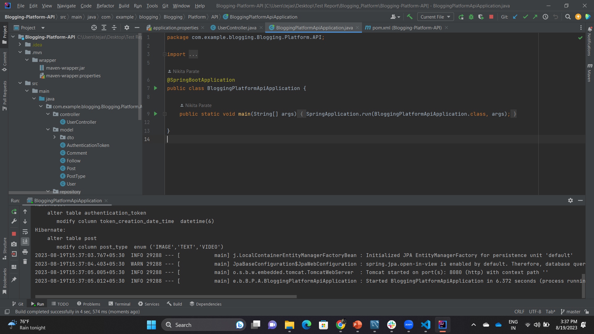

## **Frameworks and language used**
* SpringBoot Framework
* Java
## **Data Flow**
* **Controller** - RestController
  
  Used with @GetMapping, @PostMapping,@DeleteMapping,@PutMapping, @RequestBody,@PathVaraiable,@Validated,@RequestParam,@Valid and @Autowired which is linked with business logic in service class.

* **Services**

  * **UserService**

   1. SignUp Blog User
   2. SignIn Blog User
   3. Create Blog Post
   4. Remove Blog Post
   5. Add Comment
   6. Authorize Comment Remover
   7. Remove Blog Comment
   8. Get All Users
   9. Follow User
   10. Update Blog Post
   11. SignOut Blog User
   12. Unfollow User
   13. Authorize Unfollow

  * **PostService**

   1. Create Blog Post
   2. Remove Blog Post
   3. Validate Post
   4. Get Post By Id
   5. Get All Posts

   * **FollowService**

   1. Start Following
   2. Is Follow Allowed
   3. Find Follow
   4. Unfollow

   * **CommentService**

   1. Add Comment
   2. Find Comment
   3. Remove Comment

   * **AuthenticationService**

   1. Authenticate
   2. Save AuthToken
   3. remove token

* **Repository**

  JpaRepository

## **DataBase Design**

## **Data Structure used in your project**
* Arraylist
* MYSQL Database
## **Project Summary**

* This is "Blogging-Platform-Api" Application which follows MVC-architecture.I have created this project by using spring initilizer by taking 7 dependency i.e., lombok, spring web,Mysql,JPA,Email,swagger,and Validation. In my model package I have User,Authentication,Follow,Post,Comment class which has all its related data.
* A user can SignUp and SignIn on Blogging Platform.
* A User can create a Post on Blogging Platform.
* A User can follow another User on Blogging Platform.
* A user can post a comment on another's post on this Blogging Platform.
* A PostOwner can delete his post and comments.
* Any user can delete his comment.

This is a brief summary of my project where we can perform all these task smoothly and efficiently.

## **Video Explanation link**

**https://drive.google.com/file/d/1uyqvKocq5YOGLff6RKIqetMhuYasVak6/view?usp=sharing**

